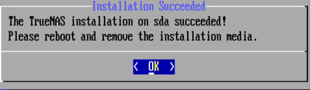
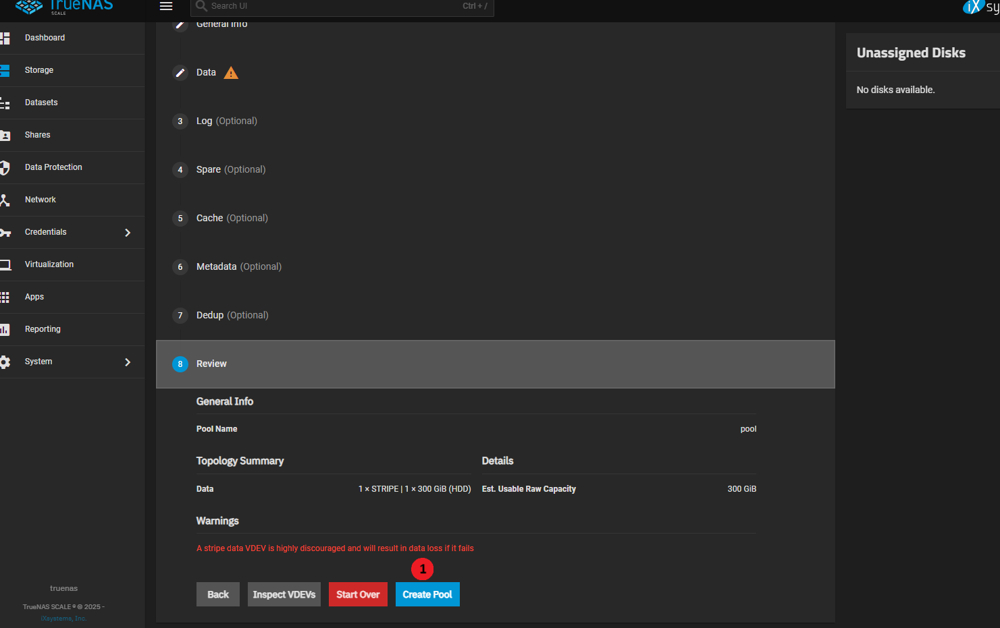
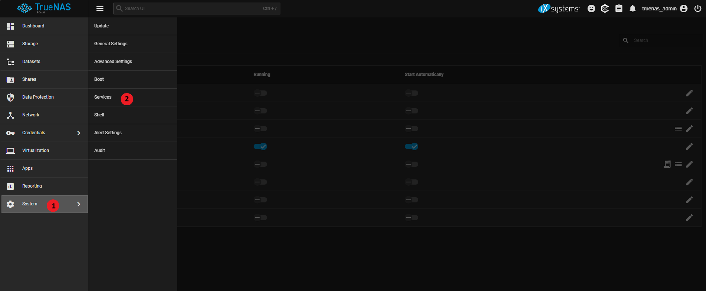

# 🔥K8S建置架構說明

## 什麼是RKE2

>  **(Rancher Kubernetes Engine)**
>> *  RKE2是一種Kubernetes distribution. 
>> *  [CNCF Certified partners and providers.](https://landscape.cncf.io/?group=certified-partners-and-providers&view-mode=grid)
>> *  RKE2以Apache-2.0 license 開源.
>> *  [RKE2是SUSE旗下的開源專案之一.](https://www.rancher.com/projects)
>> *  [RKE2同時提供商業支援.](https://www.rancher.com/quick-start)
>> *  [國內代理廠商](https://www.palsys.com.tw/product_detail.php?id=186)

## RKE2 架構

[Kubenetes 官方參考](https://kubernetes.io/zh-cn/docs/concepts/architecture/)


## RKE2 HA 架構


- - -
# 🔥RKE2 with kube-vip 安裝
- - -

## RKE2 安裝

[RKE2安裝需求](https://docs.rke2.io/install/requirements)

__安裝規劃__

|Node Name|  Description  |     IP    |
|---------|---------------|-----------|
|kube vip | cluster VIP   | 10.0.1.100|
|master1  | control plane | 10.0.1.101|
|master2  | control plane | 10.0.1.102|
|master3  | control plane | 10.0.1.103|
|gpu-node | gpu provider  | 10.0.1.104|
|harbor   | registry      | 10.0.1.105|
|TrueNas  | storage       | 10.0.1.106|

__可參考Nutanix官網的安裝方法__

[Deploy Highly Available RKE2 with Kube-VIP](https://portal.nutanix.com/page/documents/solutions/details?targetId=BP-2103-Rancher-SUSE-Nutanix:deploy-highly-available-rke2-with-kube-vip.html)

__以root 身份進行安裝__

```shell
sudo su -
```

__安裝環境變數__

| Environment Variable    | Description |
| ------------------------| ----------- |
| INSTALL_RKE2_VERSION    | Version of RKE2 to download from GitHub. Will attempt to download the latest release from the stable channel if not specified. INSTALL_RKE2_CHANNEL should also be set if installing on an RPM-based system and the desired version does not exist in the stable channel.   |
| INSTALL_RKE2_TYPE       | Type of systemd service to create, can be either "server" or "agent" Default is "server".        |
| INSTALL_RKE2_CHANNEL_URL| Channel URL for fetching RKE2 download URL. Defaults to https://update.rke2.io/v1-release/channels.|
| INSTALL_RKE2_CHANNEL    | Channel to use for fetching RKE2 download URL. Defaults to stable. Options include: stable, latest, testing. |
| INSTALL_RKE2_METHOD     | Method of installation to use. Default is on RPM-based systems rpm, all else tar. |

__建立環境變數__

```shell
export RKE2_API_VIP=<API_SERVER_VIP_IP>
export RKE2_NODE_0_IP=<CONTROL_PLANE_FIRST_NODE_IP>
export RKE2_NODE_1_IP=<CONTROL_PLANE_SECOND_NODE_IP>
export RKE2_NODE_2_IP=<CONTROL_PLANE_THIRD_NODE_IP>
export NODE_JOIN_TOKEN=`echo "$(uuidgen)::$(openssl rand -hex 16)"`
export INTERFACE=ens18
export KUBE_VIP_VERSION=v0.8.9
```

__建立RKE2 所需目錄__

```shell
mkdir -p /etc/rancher/rke2
mkdir -p /var/lib/rancher/rke2/server/manifests/
```

__建立Rancher RKE2 config.yaml (可以根據所需環境設定disable選項)__

```shell
cat <<EOF | tee /etc/rancher/rke2/config.yaml
token: ${NODE_JOIN_TOKEN}
tls-san:
- ${HOSTNAME}
- ${RKE2_API_VIP}
- ${RKE2_NODE_0_IP}
- ${RKE2_NODE_1_IP}
- ${RKE2_NODE_2_IP}
write-kubeconfig-mode: 600
EOF
```

__指定安裝版本:__
[RKE2 release](https://github.com/rancher/rke2/releases)
```shell
   ## script會檢查環境, 如不能用RPM安裝,會下載tar ball。
   curl -sfL https://get.rke2.io | INSTALL_RKE2_VERSION=v1.31.4+rke2r1 sh -
```

__不傳之秘__

[CATTLE_NEW_SIGNED_CERT_EXPIRATION_DAYS是一個被隠藏的環境變數](https://github.com/rancher/rke2/discussions/6639)
```shell
維護者的話:
 Use of CATTLE_NEW_SIGNED_CERT_EXPIRATION_DAYS is NOT officially supported, and we DO NOT document it or recommend it. However, we have no plans to remove support for this env var from the library that RKE2 uses to generate certificates.

維護者的真心話:
 Yes. You should be patching your nodes at least every few months. After a full year your Kubernetes minor version would be end of life and long overdue for an upgrade.

 Kubernetes is not a good choice for those who want to install things and then never touch it again.

如果你真的想用的話...
$ echo CATTLE_NEW_SIGNED_CERT_EXPIRATION_DAYS=3650 >> /usr/local/lib/systemd/system/rke2-server.env
systemctl enable rke2-server.service
systemctl start rke2-server.service
```

__啟用RKE2 服務__

```shell
systemctl enable rke2-server.service
systemctl start rke2-server.service
```

__查看log是否已啟用成功__

```shell
journalctl -u rke2-server -f
```

__確認RKE2 服務已啟用__

```shell
systemctl status rke2-server
```

__檢查NODE是否已經Ready__

```shell
export PATH=$PATH:/var/lib/rancher/rke2/bin
export KUBECONFIG=/etc/rancher/rke2/rke2.yaml
export CONTAINER_RUNTIME_ENDPOINT=unix:///run/k3s/containerd/containerd.sock
export CONTAINERD_ADDRESS=/run/k3s/containerd/containerd.sock

kubectl get nodes -o wide
```

## kube-vip安裝

__建立kube-vip的RBAC清單__

```shell
curl https://kube-vip.io/manifests/rbac.yaml > /var/lib/rancher/rke2/server/manifests/kube-vip-rbac.yaml
```

__抓取kube-vip image和設定別名__

```shell
crictl pull docker.io/plndr/kube-vip:$KUBE_VIP_VERSION

alias kube-vip="ctr --namespace k8s.io run --rm --net-host docker.io/plndr/kube-vip:$KUBE_VIP_VERSION vip /kube-vip"

```

__建立Kube-VIP Daemonset static pod manifests__

```shell
kube-vip manifest daemonset \
    --interface $INTERFACE \
    --address $RKE2_API_VIP \
    --inCluster \
    --taint \
    --controlplane \
    --services \
    --arp \
    --leaderElection | tee /var/lib/rancher/rke2/server/manifests/kube-vip.yaml
```

__檢查kube-vip是否已部署成功__

```shell
kubectl get ds -n kube-system kube-vip-ds
```

__在其餘二台NODE重覆上述動作, 除了config.yaml再多新增server選項__

```shell
cat <<EOF | tee /etc/rancher/rke2/config.yaml
server: https://${RKE2_API_VIP}:9345
token: ${NODE_JOIN_TOKEN}
tls-san:
- ${HOSTNAME}
- ${RKE2_API_VIP}
- ${RKE2_NODE_0_IP}
- ${RKE2_NODE_1_IP}
- ${RKE2_NODE_2_IP}
write-kubeconfig-mode: 600
EOF
```

## RKE2 work node安裝

__安裝agent__

```shell
   curl -sfL https://get.rke2.io | INSTALL_RKE2_TYPE="agent" INSTALL_RKE2_VERSION=v1.31.4+rke2r1 sh -
```

__建立RKE2 所需目錄__

```shell
mkdir -p /etc/rancher/rke2
```

__編輯/etc/rancher/rke2/config.yaml__

```shell
server: https://${RKE2_API_VIP}:9345
token: ${NODE_JOIN_TOKEN}
```

__直接啟用rke2-agent服務__

```shell
   systemctl enable rke2-agent.service
   systemctl start rke2-agent.service
```

__使用kubectl工具程式, 查看目前的元件狀態__

```shell
   kubectl get --raw='/readyz?verbose'
```

__檢查是否已加入cluster__

```shell
   kubectl get nodes
```

- - -
# 🔥Deploy NVIDIA GPU operator
- - -


__什麼是 GPU operator__

[NVIDIA GPU Operator Overview](https://www.youtube.com/watch?v=KER0dbfmAqQ)


__安裝之前需先安裝nvidia driver__

[NVIDIA 官方下載](https://www.nvidia.com/zh-tw/drivers/)

```shell
/* 查看driver及CUDA版本 */

# nvidia-smi
Mon Mar 31 15:33:57 2025       
+-----------------------------------------------------------------------------------------+
| NVIDIA-SMI 550.120                Driver Version: 550.120        CUDA Version: 12.4     |
|-----------------------------------------+------------------------+----------------------+
| GPU  Name                 Persistence-M | Bus-Id          Disp.A | Volatile Uncorr. ECC |
| Fan  Temp   Perf          Pwr:Usage/Cap |           Memory-Usage | GPU-Util  Compute M. |
|                                         |                        |               MIG M. |
|=========================================+========================+======================|
|   0  NVIDIA GeForce 940MX           Off |   00000000:02:00.0 Off |                  N/A |
| N/A   40C    P8             N/A /  200W |      29MiB /   2048MiB |      0%      Default |
|                                         |                        |                  N/A |
+-----------------------------------------+------------------------+----------------------+
                                                                                         
+-----------------------------------------------------------------------------------------+
| Processes:                                                                              |
|  GPU   GI   CI        PID   Type   Process name                              GPU Memory |
|        ID   ID                                                               Usage      |
|=========================================================================================|
|    0   N/A  N/A      4042      G   /usr/lib/xorg/Xorg                              2MiB |
|    0   N/A  N/A      4320    C+G   ...libexec/gnome-remote-desktop-daemon         20MiB |
+-----------------------------------------------------------------------------------------+
```

## 使用helm來部署nvidia gpu operator

[helm 官網](https://helm.sh/)

```
helm是Kubernetes的套件管理器，chart則為該套件格式。
```

__Helm Version Support Policy__

[helm veison support policy](https://helm.sh/zh/docs/topics/version_skew/)

```
Helm的版本以x.y.z方式描述，x為主版本，y為次要版本，z則為patch版本，遵循Semantic Versioning。
從helm3開始， 會與kubernetes保持n-3版本的相容， 例如： helm版本為3.12.x, 則對應kubernetes的
相容版本為1.27.x - 1.24.x。
```

## helm安裝方式 
 
* Binary 方式安裝

  1. 直接從github下載: https://github.com/helm/helm/releases
  2. 直接解壓縮 （tar -zxvf helm-v3.0.0-linux-amd64.tar.gz）
  3. 移動到所要目錄位置（mv linux-amd64/helm /usr/local/bin/helm）

* Script 方式安裝

  ```shell
  $ curl -fsSL -o get_helm.sh https://raw.githubusercontent.com/helm/helm/main/scripts/get-helm-3
  $ chmod 700 get_helm.sh
  $ ./get_helm.sh
  ```

__新增一個repo__

```shell
### 將一個chart倉庫url加入
$ helm repo add bitnami https://charts.bitnami.com/bitnami
"bitnami" has been added to your repositories
```

__查看該倉庫的chart 列表__
```shell
$ helm search repo bitnami

NAME                                        	CHART VERSION	APP VERSION  	DESCRIPTION                                       
bitnami/airflow                             	22.7.0       	2.10.5       	Apache Airflow is a tool to express and execute...
bitnami/apache                              	11.3.4       	2.4.63       	Apache HTTP Server is an open-source HTTP serve...
bitnami/apisix                              	4.2.0        	3.11.0       	Apache APISIX is high-performance, real-time AP...
bitnami/appsmith                            	5.2.2        	1.64.0       	Appsmith is an open source platform for buildin...
bitnami/argo-cd                             	7.3.0        	2.14.7       	Argo CD is a continuous delivery tool for Kuber...
bitnami/argo-workflows                      	11.1.10      	3.6.5        	Argo Workflows is meant to orchestrate Kubernet...
bitnami/aspnet-core                         	6.3.5        	8.0.14       	ASP.NET Core is an open-source framework for we...
bitnami/cassandra                           	12.2.2       	5.0.3        	Apache Cassandra is an open source distributed ...
```

__新增 NVIDIA Helm 儲存庫__

```shell
$ helm repo add nvidia https://helm.ngc.nvidia.com/nvidia && helm repo update
```

__安裝gpu operator__

```shell
 $ helm install --wait --generate-name \
    -n gpu-operator --create-namespace \
    nvidia/gpu-operator \
    --version=v25.3.2 \
    --set operator.defaultRuntime=containerd \
    --set driver.enabled=false \
    --set toolkit.env[0].name=CONTAINERD_CONFIG \
    --set toolkit.env[0].value=/var/lib/rancher/rke2/agent/etc/containerd/config.toml \
    --set toolkit.env[1].name=CONTAINERD_SOCKET \
    --set toolkit.env[1].value=/run/k3s/containerd/containerd.sock \
    --set toolkit.env[2].name=CONTAINERD_RUNTIME_CLASS \
    --set toolkit.env[2].value=nvidia \
    --set toolkit.env[3].name=CONTAINERD_SET_AS_DEFAULT \
    --set-string toolkit.env[3].value=true
    
```

__檢查該GPU node是否已偵測到GPU及driver__

```shell
 $ kubectl get node $NODENAME -o jsonpath='{.metadata.labels}' | jq | grep "nvidia.com"
   "nvidia.com/cuda.driver-version.full": "550.120",
   "nvidia.com/cuda.driver-version.major": "550",
   "nvidia.com/cuda.driver-version.minor": "120",
   "nvidia.com/cuda.driver-version.revision": "",
   "nvidia.com/cuda.driver.major": "550",
   "nvidia.com/cuda.driver.minor": "120",
   "nvidia.com/cuda.driver.rev": "",
   "nvidia.com/cuda.runtime-version.full": "12.4",
   "nvidia.com/cuda.runtime-version.major": "12",
   "nvidia.com/cuda.runtime-version.minor": "4",
   "nvidia.com/cuda.runtime.major": "12",
   "nvidia.com/cuda.runtime.minor": "4",
   "nvidia.com/gfd.timestamp": "1743408700",
   "nvidia.com/gpu.compute.major": "5",
   "nvidia.com/gpu.compute.minor": "0",
   ............................................
   ............................................
   ............................................(省略)
```

__檢查container runtime binary已被operator安裝__

```shell
/* 在GPU node上檢查 */
$ ls /usr/local/nvidia/toolkit/nvidia-container-runtime
```

__檢查containerd config 已被更新__

```shell
# grep nvidia /var/lib/rancher/rke2/agent/etc/containerd/config.toml
plugins."io.containerd.grpc.v1.cri".containerd.runtimes."nvidia"]
[plugins."io.containerd.grpc.v1.cri".containerd.runtimes."nvidia".options]
  BinaryName = "/usr/local/nvidia/toolkit/nvidia-container-runtime"
[plugins."io.containerd.grpc.v1.cri".containerd.runtimes."nvidia-cdi"]
[plugins."io.containerd.grpc.v1.cri".containerd.runtimes."nvidia-cdi".options]
  BinaryName = "/usr/local/nvidia/toolkit/nvidia-container-runtime.cdi"
```

__建立一個Pod來測試GPU__

```shell
kubectl apply -f -<<EOF
apiVersion: v1
kind: Pod
metadata:
  name: nbody-gpu-benchmark
  namespace: default
spec:
  restartPolicy: OnFailure
  runtimeClassName: nvidia
  containers:
  - name: cuda-container
    image: nvcr.io/nvidia/k8s/cuda-sample:nbody
    args: ["nbody", "-gpu", "-benchmark"]
    resources:
      limits:
        nvidia.com/gpu: 1
    env:
    - name: NVIDIA_VISIBLE_DEVICES
      value: all
    - name: NVIDIA_DRIVER_CAPABILITIES
      value: all
EOF
```

__檢查 pod 運行的日誌:__

```shell
$ kubectl logs pod/nbody-gpu-benchmark
Run "nbody -benchmark [-numbodies=<numBodies>]" to measure performance.
	-fullscreen       (run n-body simulation in fullscreen mode)
	-fp64             (use double precision floating point values for simulation)
	-hostmem          (stores simulation data in host memory)
	-benchmark        (run benchmark to measure performance) 
	-numbodies=<N>    (number of bodies (>= 1) to run in simulation) 
	-device=<d>       (where d=0,1,2.... for the CUDA device to use)
	-numdevices=<i>   (where i=(number of CUDA devices > 0) to use for simulation)
	-compare          (compares simulation results running once on the default GPU and once on the CPU)
	-cpu              (run n-body simulation on the CPU)
	-tipsy=<file.bin> (load a tipsy model file for simulation)

NOTE: The CUDA Samples are not meant for performance measurements. Results may vary when GPU Boost is enabled.

> Windowed mode
> Simulation data stored in video memory
> Single precision floating point simulation
> 1 Devices used for simulation
GPU Device 0: "Maxwell" with compute capability 5.0

> Compute 5.0 CUDA device: [NVIDIA GeForce 940MX]
3072 bodies, total time for 10 iterations: 3.641 ms
= 25.917 billion interactions per second
= 518.344 single-precision GFLOP/s at 20 flops per interaction
```

__不用runtimeclassname__

```
kubectl run gpu-test --rm -t -i --restart=Never --image=nvcr.io/nvidia/cuda:10.1-base-ubuntu18.04 nvidia-smi
```

__設定default runtimeclass__

```shell
/* 編輯/var/lib/rancher/rke2/agent/etc/containerd/config.toml.tmpl */

[plugins."io.containerd.grpc.v1.cri".containerd]
  default_runtime_name = "nvidia"

/* 重新啟動服務 */
 $ systemctl restart rke2-agent.service

/* 確認default runtime是否已為nvidia */
$ crictl info | jq '.config.containerd.defaultRuntimeName'
```

- - -
# 🔥 Harbor 安裝
- - -

[Harbor 官網](https://goharbor.io/)

> Harbor是一種registry(用以存放container image的地方), VMware 捐獻給CNCF,使用
> open source (Apach-2.0 license)釋出, 以RBCA控制存取, 並掃瞄image確保沒有漏洞,
> 而且將image標記為可信任的。 

__Harware需求__

|Resource|Minimum|Recommended|
|--------|-------|-----------|
|CPU     |2 CPU  |4 CPU      |
|Mem     |4 GB   |8 GB       |
|Disk    |40 GB  |160 GB     |

__Software需求__

|Software      |Version              |Description                                                          |
|--------------|---------------------|---------------------------------------------------------------------|                                       
|Docker Engine |Version > 20.10      |[Docker Engine Installation](https://docs.docker.com/engine/install/)|
|Docker Compose|Docker compose > 2.3 |Docker Compose is part of Docker Engine                              |
|OpenSSL       |Latest (optional)    |Used to generate certificate and keys for Harbor                     |

__Network Port__

|Port|Protocol|Description                                                                                                       |
|----|--------|------------------------------------------------------------------------------------------------------------------|
|443 |HTTPS   |Harbor portal and core API accept HTTPS requests on this port. You can change this port in the configuration file.|
|80  |HTTP    |Harbor portal and core API accept HTTP requests on this port. You can change this port in the configuration file. |

## 安裝 

*  直接至[github](https://github.com/goharbor/harbor/releases?page=1)下載所要的版本, 有分online或offline二種方式。
*  安裝harbor之前需先安裝好docker。
```shell
 /* 解壓縮檔案 */
 # tar -zxvf harbor-online-installer-v2.12.2.tgz 
 # cd harbor

 /* 複製harbor.yml.tmpl */
 # cp harbor.yml.tmpl harbor.yml

 /* 編輯harbor.yml 
    hostname： 用以存取admin UI和registry service，IP 或 FQDN.
    certificate: 憑證位置。
    private_key: 私鑰位置。           
*/

 hostname: 10.0.1.105
 certificate: /data/cert/edwin.io.crt
 private_key: /data/cert/edwin.io.key 
 harbor_admin_password: Harbor12345     # 預設admin密碼
 password: root123           # 預設DB密碼   

/* 建立/data/cert目錄 */
# mkdir -p /data/cert

/* 建立CA憑證 */

1. CA certificate private key.
# openssl genrsa -out ca.key 4096

2. Generate the CA certificate.
# openssl req -x509 -new -nodes -sha512 -days 3650  -subj "/C=TW/ST=Kaohsiung/L=Kaohsiung/O=Gundam/OU=Personal/CN=Harbor Root CA"  -key ca.key  -out ca.crt

/* 產生server憑證 */
1. Generate a private key.
# openssl genrsa -out edwin.io.key 4096

2. Generate a certificate signing request (CSR).
# openssl req -sha512 -new -subj "/C=TW/ST=Kaohsiunt/L=Kaohsiung/O=Neweb/OU=Personal/CN=edwin.io" -key edwin.io.key -out edwin.io.csr

3. Generate an x509 v3 extension file.
# cat > v3.ext <<-EOF
authorityKeyIdentifier=keyid,issuer
basicConstraints=CA:FALSE
keyUsage = digitalSignature, nonRepudiation, keyEncipherment, dataEncipherment
extendedKeyUsage = serverAuth
subjectAltName = @alt_names

[alt_names]
DNS.1=yourdomain.com
# or IP
IP.1=10.0.1.105
DNS.2=yourdomain
DNS.3=hostname
EOF

4. Use the v3.ext file to generate a certificate for your Harbor host.
# openssl x509 -req -sha512 -days 3650 -extfile v3.ext -CA ca.crt -CAkey ca.key -CAcreateserial -in edwin.io.csr -out edwin.io.crt

/* 將上面產生的憑證提供給harbor及docker */

1. 複製到harbor主機上的/data/cert目錄
# cp edwin.io.crt /data/cert/
# cp edwin.io.key /data/cert/

2. 將edwin.io.crt轉換成edwin.io.cert給docker使用
# openssl x509 -inform PEM -in edwin.io.crt -out edwin.io.cert

3. 將server certificate, key and CA files複製到docker目錄
# cp edwin.io.cert /etc/docker/certs.d/10.0.1.105/
# cp edwin.io.key  /etc/docker/certs.d/10.0.1.105/
# cp ca.crt /etc/docker/certs.d/10.0.1.105/

4. Restart Docker Engine.
# systemctl restart docker

/* 設定harbor*/
1. Run the prepare script to enable HTTPS.
# ./prepare
# ./install.sh --with-trivy (如果尚未安裝)

2. If Harbor is running, stop and remove the existing instance.
# docker compose down -v

3. Restart Harbor:
# docker compose up -d

至此, 應該可以打開browser看到harbor介面了。
```

__關機__

```shell
 /* 在harbor目錄中下此指令 */

# docker compose stop
Stopping nginx              ... done
Stopping harbor-portal      ... done
Stopping harbor-jobservice  ... done
Stopping harbor-core        ... done
Stopping registry           ... done
Stopping redis              ... done
Stopping registryctl        ... done
Stopping harbor-db          ... done
Stopping harbor-log         ... done
```

__開機__

```shell
 /* 在harbor目錄中下此指令 */

# docker compose start
Starting log         ... done
Starting registry    ... done
Starting registryctl ... done
Starting postgresql  ... done
Starting core        ... done
Starting portal      ... done
Starting redis       ... done
Starting jobservice  ... done
Starting proxy       ... done
```

__重新設定__

```shell
1. Stop Harbor.
# docker compose down -v

2. Update harbor.yml
# vim harbor.yml

3. Run the prepare script to populate the configuration.
# ./prepare
  或是需要安裝Trivy,
# ./prepare --with-trivy

4. Re-create and start the Harbor instance.
# docker compose up -d

```

## 測試image上傳

```shell
/* loging 到 harbor */
# docker login https://10.0.1.105

/* 將本地image 先做tag */
# docker tag hello-world:latest 10.0.1.105/library/myapp:v1.0

/* 推送imgage到harbor */
# docker push 10.0.1.105/library/myapp:v1.0
```

## 撰寫systemd 服務 (/etc/systemd/system/)

```shell
[Unit]
Description=Harbor Container Registry
After=docker.service systemd-networkd.service systemd-resolved.service
Requires=docker.service

[Service]
Type=simple
Restart=on-failure
RestartSec=5
WorkingDirectory=/root/harbor
ExecStart=/usr/bin/docker compose -f /root/harbor/docker-compose.yml up
ExecStop=/usr/bin/docker compose -f /root/harbor/docker-compose.yml down

[Install]
WantedBy=multi-user.target
```

## 私有registry設定

__在所需拉取image的節點上編輯設定檔__

編輯/etc/rancher/rke2/registries.yaml

```shell 
mirrors:
  edwin.io:
    endpoint:
      - "https://10.0.1.105"
configs:
  "10.0.1.105":
    tls:
      cert_file:        # path to the cert file used to authenticate to the registry
      key_file:         # path to the key file for the certificate used to authenticate to the registry
      ca_file:          # path to the ca file used to verify the registry's certificate
      insecure_skip_verify: false  # may be set to true to skip verifying the registry's certificate
```

__放置所需憑證__

```shell
$  mkdir /etc/rancher/rke2/cert

/*
 要先將harbor上的憑證複製過來,
 將/etc/docker/certs.d/10.0.1.105/目錄下
 的憑證先copy到/tmp/cert目錄下, 並將edwin.io.key
 權限改為655, 之後再改600回來。
 */

$ scp edwin@10.0.1.105:/tmp/cert/* /etc/rancher/rke2/cert/
$ chmod 600 /etc/rancher/rke2/cert/edwin.io.key

/* 
重啟rke2服務使其生效, 
可將config.toml.tmpl改為config.toml.bak,
讓新的config.toml產生。
*/

$ systemctl restart rke2-agent.service

```

__測試是否可以拉取image__

```sehll
$ kubectl run hello --rm -t -i --restart=Never --image=10.0.1.105/library/myapp:v1.0
```

- - -
# 🔥TrueNAS 安裝及設定
- - -

[TrueNAS Community Edition官網下載](https://www.truenas.com/download-truenas-community-edition/)

__Minimum Hardware Requirements__

|Processor                                  |Memory                      |Boot Device          |Storage                                                |
|-------------------------------------------|----------------------------|---------------------|-------------------------------------------------------|
|2-Core Intel 64-Bit or AMD x86_64 processor|8 GB RAM (16 GB Recommended)|16 GB SSD boot device|Two identically-sized devices for a single storage pool|

## 安裝

版本: 24.10.2

__載入安裝光碟開始安裝__


__直接點選[OK]開始安裝__


__選取所安裝的硬碟, 並點選[OK]__


__點選[Yes]__


__點選[OK], 預設帳號為truenas_admin__


__設定密碼後點選[OK]__


__確認無誤後點選[Yes]__


__安裝成功後, 點選[OK]__



__點選[Reboot System]後再點選[OK]__


__開機後已有DHCP, 登入網頁開始設定__


## 設定

__建立一個Pool, [Storage]->[Create pool]__


__輸入pool名稱, 按下[Save]__


__選擇RAID level, 按下[Save]__


__Review沒問題後, 按下[Create Pool]__



__勾選[Confirm]->[Continue]__


__建立一個dataset, [Add Dataset]__


__輸入dataset名稱, [Save]__


__點選[System]->[Service]__



__開啟NFS及SSH服務__


__勾選[NFSv3 ownership model for NFSv4], 按下[Save]__


__新增NFS Share__

__點選[Share]->[Add]__


__點選Share path,按下[Save]__


__產生ssh金鑰給root使用__

```bash
$ ssh-keygen -t rsa -C root@truenas.lab.test -f truenas_rsa

Generating public/private rsa key pair.
Enter passphrase (empty for no passphrase):
Enter same passphrase again:
Your identification has been saved in truenas_rsa
Your public key has been saved in truenas_rsa.pub
The key fingerprint is:
SHA256:bCGhVnKkh+Pq/TxQNoeL75ylGzS3Aagf6cjcmvVvOtQ root@truenas.lab.test
The key's randomart image is:
+---[RSA 3072]----+
|    ..=          |
|     O .         |
|    B +..        |
|   + +=+..       |
|  . ++o=S        |
| o *ooo+Eo       |
|  = =+. o        |
| . = ++=.        |
|  + .o@B.        |
+----[SHA256]-----+

/* 會產生一副公私鑰 */

truenas_rsa
truenas_rsa.pub
```

__點選[Credentials]->[Users]__


__展開user__


__點選[Edit]__


__將產生的[truenas_rsa.pub]的key貼上, 並將Shell選取bash__


__點選右上方選單, 並點選[API Keys]__


__點選[Add]__


__輸入一個名稱, 按下[Save]__


__按下[Copy to Clipboard], 將API key複製起來備用__


- - -
# 🔥democratic-csi安裝及設定
- - -

## 加進democratic-csi source

```shell
$ helm repo add democratic-csi https://democratic-csi.github.io/charts/
$ helm repo update
$ helm search repo democratic-csi/
```

## 設定值

__編輯一個truenas-csi.yaml__

```shell
csiDriver:
  name: "org.democratic-csi.nfs"

storageClasses:
  - name: truenas-nfs-csi
    defaultClass: true
    reclaimPolicy: Retain
    volumeBindingMode: Immediate
    allowVolumeExpansion: true
    parameters:
      fsType: nfs

    mountOptions:
      - noatime
      - nfsvers=4.2
    secrets:
      provisioner-secret:
      controller-publish-secret:
      node-stage-secret:
      node-publish-secret:
      controller-expand-secret:

# if your cluster supports snapshots you may enable below
volumeSnapshotClasses: []

driver:
  config:
    # please see the most up-to-date example of the corresponding config here:
    # https://github.com/democratic-csi/democratic-csi/tree/master/examples
    # YOU MUST COPY THE DATA HERE INLINE!
    driver: freenas-nfs
    instance_id:
    httpConnection:
      protocol: http
      host: <Put your TrueNAS FQDN or fixed IP here>
      port: 80
      apiKey: <Use the api key retrieved from the TrueNAS server>
      username: root
      allowInsecure: true
      apiVersion: 2
    sshConnection:
      host: <Put your TrueNAS FQDN or fixed IP here>
      port: 22
      username: root
      # use either password or key
      privateKey: |
        <Paste the ssh private key of your authorized server here>
    zfs:
      datasetParentName: <Use the dataset name you created on the storage server, ie: hdd/nfs>
      detachedSnapshotsDatasetParentName: <Use the dataset name you created on the storage serverie: hdd/snapshots>
      datasetEnableQuotas: true
      datasetEnableReservation: false
      datasetPermissionsMode: "0777"
      datasetPermissionsUser: 0
      datasetPermissionsGroup: 0
    nfs:
      shareHost: <Put your TrueNAS FQDN or fixed IP here>
      shareAlldirs: false
      shareAllowedHosts: []
      shareAllowedNetworks: []
      shareMaprootUser: root
      shareMaprootGroup: wheel
      shareMapallUser: ""
      shareMapallGroup: ""
```

__使用helm安裝及設定__

```shell
helm upgrade \
  --install \
  --create-namespace \
  --values truenas-csi.yaml \
  --namespace democratic-csi \
  zfs-nfs democratic-csi/democratic-csi
```

__檢查安裝後的狀態__

```shell
$ helm ls -Aa
```

__檢查Pod是否running__

```shell
$ kubectl -n democratic-csi get pods
```

__檢查storage class狀態__

```shell
$ kubectl get sc
```

__如果有多個storage class, 有偏好的storage class可設為預設__

```shell
$ kubectl patch storageclass truenas-nfs-csi -p '{"metadata": {"annotations":{"storageclass.kubernetes.io/is-default-class":"true"}}}'
```

## 安裝後檢核

__編輯一個pvc-20m.yaml__

```shell
apiVersion: v1
kind: PersistentVolumeClaim
metadata:
  name: pvc-20m
  namespace: default
spec:
  storageClassName: truenas-nfs-csi
  accessModes:
    - ReadWriteOnce
  resources:
    requests:
      storage: 20Mi
```

__Apply pvc-20m.yaml__

```shell
$ kubectl apply -f pvc-20m.yaml
```

__確認pv是否建立__

```shell
$ kubectl get pv | grep pvc-20m
```

__編輯zfs-pod.yaml,會建立一個pod並將volume掛載上__

```shell
apiVersion: v1
kind: Pod
metadata:
  name: zfs-pod
  namespace: default
spec:
  containers:
  - image: ubuntu:22.04
    name: foo
    command:
    - tail
    - -f
    - /dev/null
    volumeMounts:
    - mountPath: /test-pvc
      name: test-pvc
  volumes:
  - name: test-pvc
    persistentVolumeClaim:
      claimName: pvc-20m
```

__Apply zfs-pod.yaml__

```shell
$ kubectl apply -f zfs-pod.yaml
```

__進入pod檢查是否掛載volume了__

```shell
$ kubectl exec -it zfs-pod -- bash

/* 進入後 */
$ df -h | grep test-pvc
```

__建立一個檔案後並到Truenas檢查檔案是否存在了__

```shell
$ cd /test-pvc
$ touch hello
$ ls hello
hello
```

__測完後就可以刪除剛測試資料__

```shell
kubectl delete pod zfs-pod
kubectl delete pvc pvc-20m
kubectl delete pv pvc-xxxxxxxx-xxxx-xxxx-xxxx-xxxxxxxxxxxx

/* 移除pv後還要到Truenas刪除該PV目錄才會真的刪除 */
```

__點選[Shares]->[刪除]__


__點選[Confirm]->[Continue]__


__點選[Datasets], 選取該dataset,再點選[Delete]__


__輸入該dataset名稱, 再勾選[Confirm]->[DELETE DATASET]__


- - -
# 🔥K8S 常用指令簡介
- - -

## kubectl設定與自動補全

__kubectl設定__

```shell
/* 在user home目錄下建立.kube目錄 */
$ mkdir .kube
$ sudo cp /etc/rancher/rke2/rke2.yaml .kube/config
$ sudo chown `whoami`:`whoami` .kube/config
$ echo 'export PATH=$PATH:/var/lib/rancher/rke2/bin' >> .profile
$ . ./.profile
```

__kubectl指令自動補全__

```shell
$ echo 'source <(kubectl completion bash)' >>~/.bashrc
$ echo 'alias k=kubectl' >>~/.bashrc
$ echo 'complete -o default -F __start_kubectl k' >>~/.bashrc
$ . ./.bashrc
```

## kubectl Cheatsheet

[官方完整指令](https://kubernetes.io/docs/reference/generated/kubectl/kubectl-commands)

__list nodes and pods__

```shell
$ kubectl get nodes
$ kubectl get pod -A
$ kubectl get pod -A -o wide      # 獲得較多輸出訊息
```

__為節點主機打上label__

```shell
$ kubectl label node gpu-node node-role.kubernetes.io/1080Tigpu=
```

__設定那些節點不會被納入pod的排程__

```shell
$ kubectl taint nodes master1 node-role.kubernetes.io/controlplane=true:NoSchedule
$ kubectl describe node master1 | grep Taints      # 查看taint是否存在
$ kubectl taint nodes master1 node-role.kubernetes.io/controlplane=true:NoSchedule-   # 取消taint
```

__進入pod操作命令__

```shell
$ kubectl exec -it -n kube-system etcd-master1 -- etcdctl version
```

## Troubleshooting

```shell
/* 使用describe來獲得Node或pod的verbose output */

$ kubectl describe node
$ kubectl describe pod etcd-master1 -n kube-system

/* 使用logs來查看pod中的log輸出 */

$ kubectl logs etcd-master1 -n kube-system

/* 使用top來查看資源耗用 */

$ kubectl top node
$ kubectl top pod -A


```
### RKE2 logs位置

__System__

  RKE2 以systemd服務運行,故可以查看syslog的log記錄

```shel
/var/log/syslog
```

__Kubelet__

可以用PS查看kubelet啟動時所帶參數

```shell
/var/lib/rancher/rke2/agent/logs/kubelet.log
```

__Server__

```shell
journalctl -u rke2-server -f
systemctl status rke2-server.service
```

__MISC__

```shell
 /var/log/containers
 /var/log/pods